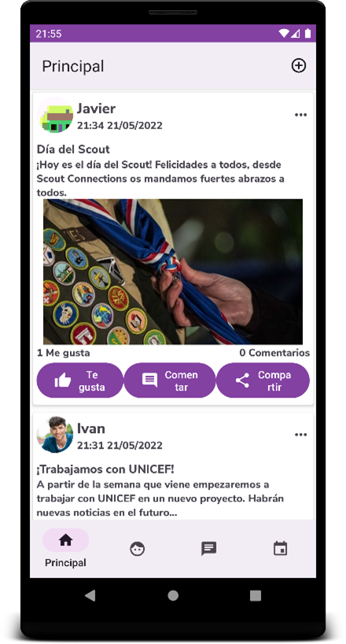
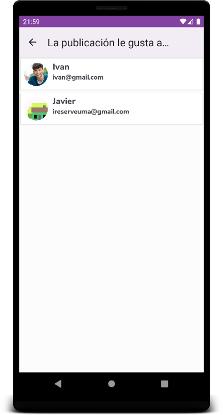
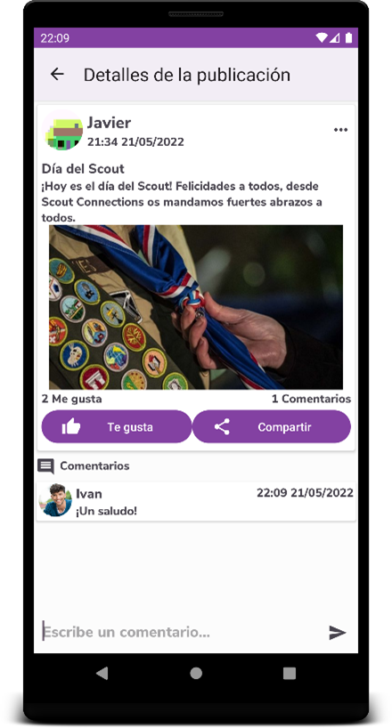
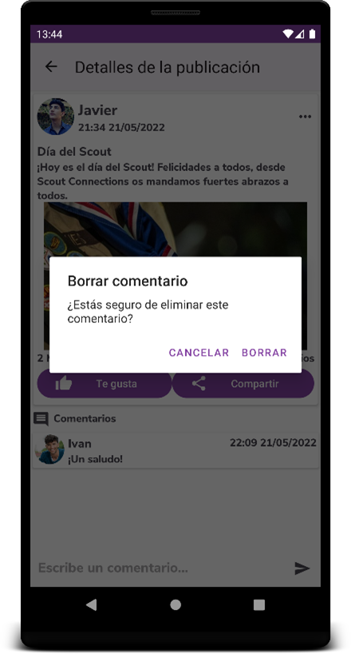
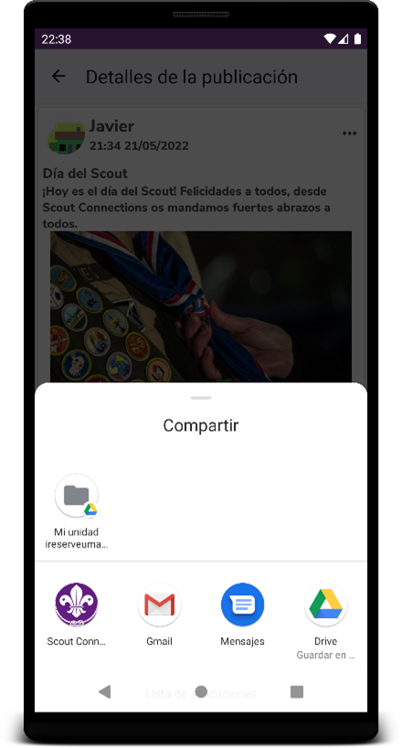

# Scout Connections

## Project definition:

As my Final Degree Project I developed Scout Connections, a mobile application for Android
devices that allows social interaction between members of a scout association
with different roles. Each member will be able to register or login/out in it,
additionally being able to configure his/her profile, which will also be visible to
other members. The application has social network style posts with likes,
comments, etc. In addition, the software includes conversations between users
of the organization, also having the possibility of creating groups of several
users to share information more easily. Likewise, it allows to indicate future
events of the association in a calendar that will be available to all members.

## Project features:

- Firebase Authentication
- Firebase Realtime Database
- Firebase Storage
- Firebase Messaging
- Picasso
- Volley
- Gson
- Spanish and English traductions
- Material Design

## Start screen

It is assumed that the application is already installed on the device and that its Android version is higher than 4.4, so it will only be necessary to click on its icon in the installed applications section. The application will open along with its startup.

## Register

In order to register, it is necessary to access the registration section, fill in the fields with the email and a password with at least 6 digits, and click on "Register". If you already have an account, click the link below will access the login. When creating the account, the main page of the application opens.

## Login

The login can be done through a previously created account, filling in the fields with the email and password, or through a Google account. If you do not have an account, you can create a new one by clicking on the link below. If the password has been forgotten, it can be recovered by pressing the button provided, which will open a drop-down in which the email with which the account is created will be indicated and in which an email will be received where you can change to a new password.

## Posts

### List of posts

The list of posts appears in the "Main" section of the application.

#### Like a post

To like a post, you must press the “Like” button. The text of the button will change to "You like it", producing the action successfully.

#### See people who liked a post

By pressing the text "X Likes" where X is the number of likes that a publication has, the list of people who like said publication will open. If we click on each of them in the list, we will access their profiles.

#### Create/View post comments

In order to access the comments section of a publication, it can be done through the "Comment" button and the text "X Comments" where X is the number of comments. In order to add a comment, it is necessary to fill in the comment field below, and the information of the publication with the new comment will be updated. You can also like and share the post on this page.

#### Delete a post comment

A comment may be deleted by clicking on itself by the user who created it.

#### Share a post

By pressing the "Share" button you can share the publication in an external application to "Scout Connections" through the applications that allow it.

#### View post creator

The post creator's profile can be viewed by clicking on the creator's name above the post

### Create a post

To add a new post it is necessary to click on the upper right button and have the Monitor role, if not, the button will not appear. To create the post it is necessary to give a title and description, although it is not necessary to add an image. To create it, finally click on "Upload".

### Edit post

Pressing the "..." button will open a panel with settings on the publication of which you are the creator, being able to choose whether to edit or delete. Choosing "Edit" will open the editor of the publication, being able to edit the title, image or description.

### Delete post

You can delete an already created publication by choosing “Delete” in the options. It will be necessary to confirm the deletion.

## Profile
