# Scout Connections

## Project definition:

As my Final Degree Project I developed Scout Connections, a mobile application for Android
devices that allows social interaction between members of a scout association
with different roles. Each member will be able to register or login/out in it,
additionally being able to configure his/her profile, which will also be visible to
other members. The application has social network style posts with likes,
comments, etc. In addition, the software includes conversations between users
of the organization, also having the possibility of creating groups of several
users to share information more easily. Likewise, it allows to indicate future
events of the association in a calendar that will be available to all members.

## Project features:

- Firebase Authentication
- Firebase Realtime Database
- Firebase Storage
- Firebase Messaging
- Picasso
- Volley
- Gson
- Spanish and English traductions
- Material Design

# User Guide

## Starting screen

It is assumed that the application is already installed on the device and that its Android version is higher than 4.4, so it will only be necessary to click on its icon in the installed applications section. The application will open along with its startup.

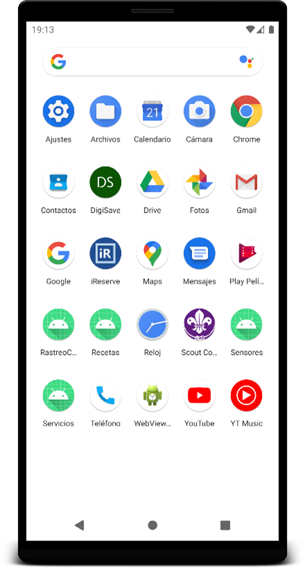
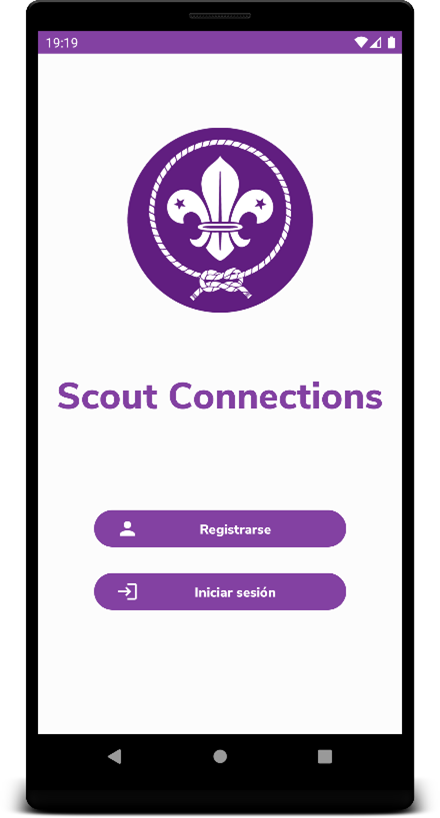

## Register

In order to register, it is necessary to access the registration section, fill in the fields with the email and a password with at least 6 digits, and click on "Register". If you already have an account, click the link below will access the login. When creating the account, the main page of the application opens.

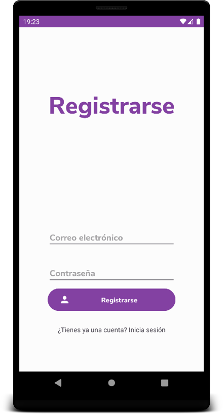

## Login

The login can be done through a previously created account, filling in the fields with the email and password, or through a Google account. If you do not have an account, you can create a new one by clicking on the link below. If the password has been forgotten, it can be recovered by pressing the button provided, which will open a drop-down in which the email with which the account is created will be indicated and in which an email will be received where you can change to a new password.

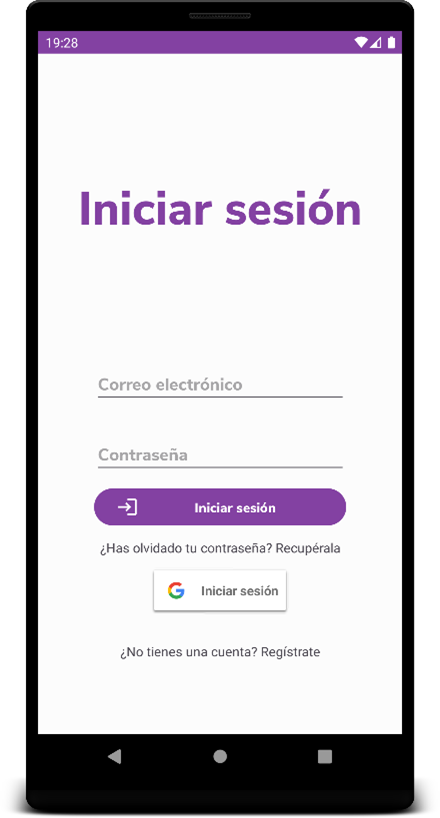
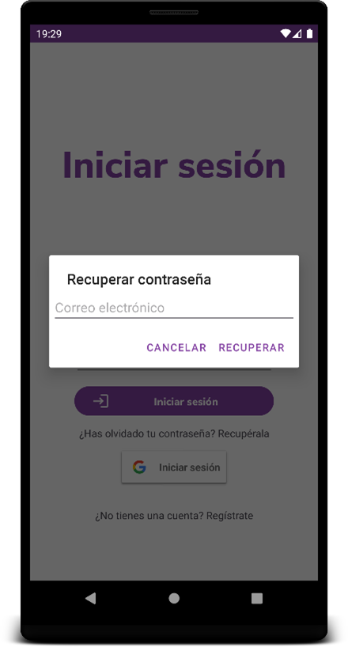

## Posts

### List of posts

The list of posts appears in the "Main" section of the application.

#### Like a post

To like a post, you must press the “Like” button. The text of the button will change to "You like it", producing the action successfully.

#### See people who liked a post

By pressing the text "X Likes" where X is the number of likes that a publication has, the list of people who like said publication will open. If we click on each of them in the list, we will access their profiles.

#### Create/View post comments

In order to access the comments section of a publication, it can be done through the "Comment" button and the text "X Comments" where X is the number of comments. In order to add a comment, it is necessary to fill in the comment field below, and the information of the publication with the new comment will be updated. You can also like and share the post on this page.

#### Delete a post comment

A comment may be deleted by clicking on itself by the user who created it.

#### Share a post

By pressing the "Share" button you can share the publication in an external application to "Scout Connections" through the applications that allow it.

#### View post creator

The post creator's profile can be viewed by clicking on the creator's name above the post

### Create a post

To add a new post it is necessary to click on the upper right button and have the Monitor role, if not, the button will not appear. To create the post it is necessary to give a title and description, although it is not necessary to add an image. To create it, finally click on "Upload".

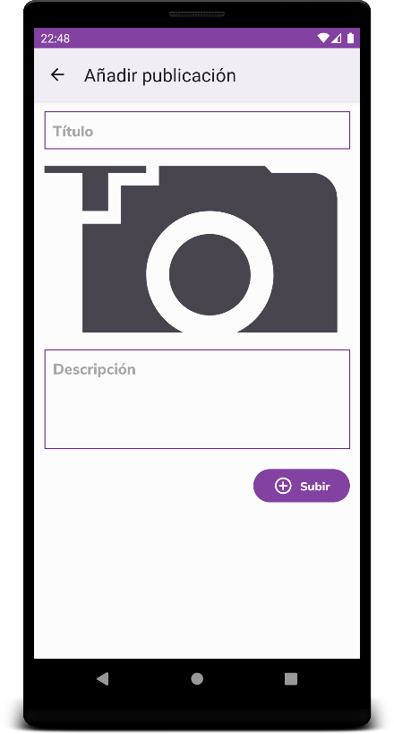
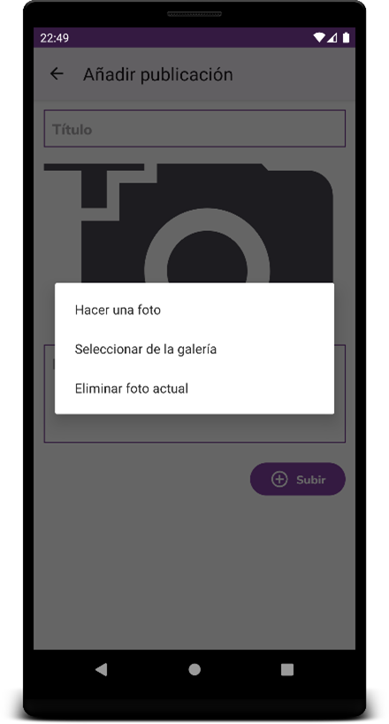

### Edit post

Pressing the "..." button will open a panel with settings on the publication of which you are the creator, being able to choose whether to edit or delete. Choosing "Edit" will open the editor of the publication, being able to edit the title, image or description.

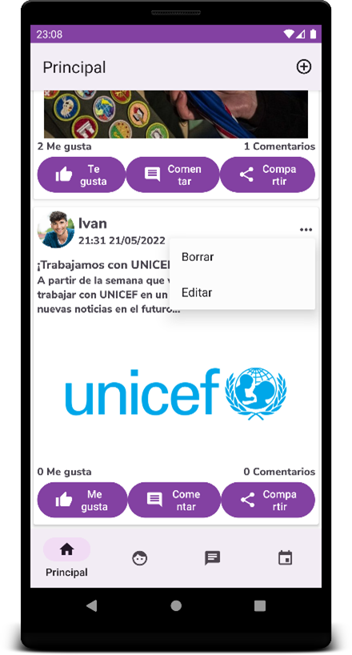
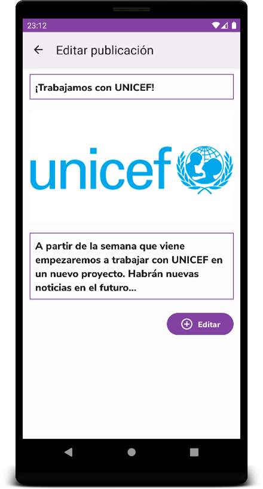

### Delete post

You can delete an already created publication by choosing “Delete” in the options. It will be necessary to confirm the deletion.

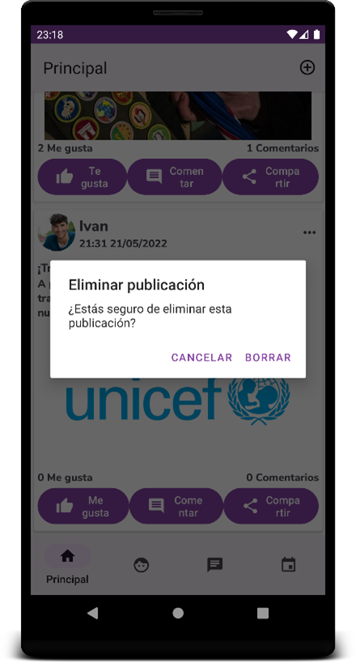

## Profile

To access the profile section, it is necessary to click on the "Profile" button in the lower navigation menu.

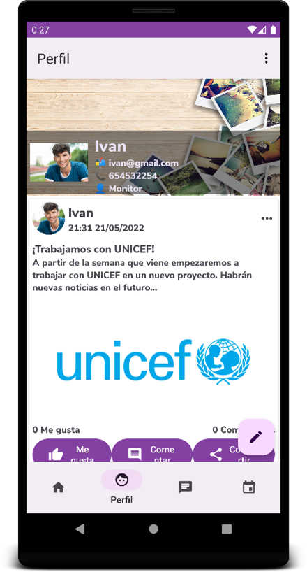

### View my profile

In the profile section, you can view personal information about the user with whom you have logged in, in addition to their created posts.

### Edit my profile

The drop-down menu to edit the profile appears by clicking on the lower right menu with the symbol of a pencil depending on whether the user has the role of "Monitor" or "Scout".

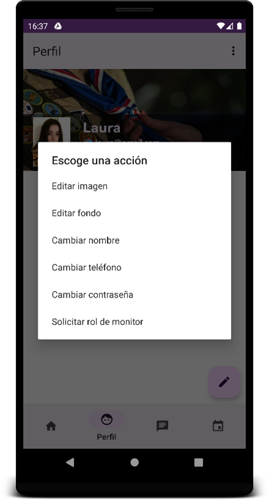

#### Edit profile picture

The profile image selection menu appears when you select “Edit Image”. It can be updated through a photo from the gallery or one taken at the moment, or in turn, be deleted.

#### Edit profile background

The profile background selection menu appears when selecting “Edit Background”. It can be updated through a photo from the gallery or one taken at the moment, or in turn, be deleted. It is a menu similar to the edit image menu.

#### Edit profile name

You will be able to edit the profile name by selecting “Change Name”. It will be necessary to fill in the field with a non-empty name and click on "Update".

#### Edit profile phone

The profile phone can be edited by selecting “Change phone”. It will be necessary to fill in the field with a non-empty phone number and click on "Update".

#### Edit profile password

To be able to update the password with which the session is carried out, you will have to click on “Change password”. It will be necessary to put the old password and a new one with a minimum of 6 digits. For the changes to be made, click on “Update”.

#### Request monitor role

A user with a Scout role can request a monitor role through an email to the account scoutconnectionstfg@gmail.com, which will be done by clicking "Request monitor role" in the menu, and in turn through any service email.

### Logout

When displaying the upper right menu, pressing "Logout" will automatically close the session of the user with whom it was already started.

### View another user's profile

The profile of a person other than the one who has logged in can also be seen, although to do so, it is necessary to access from different sections of the application as they have been or will be mentioned. You will be able to see your personal information and created posts, as well as have the opportunity to open the chat to start or continue the conversation.

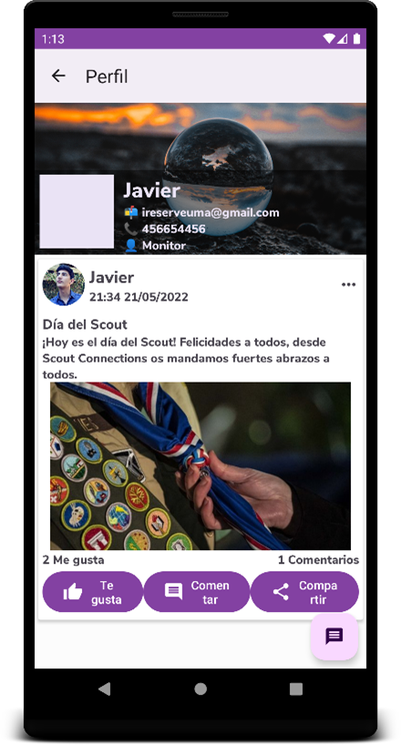

## Social

The social section of the application can be accessed through the lower navigation menu, by pressing "Social", appearing its main page.

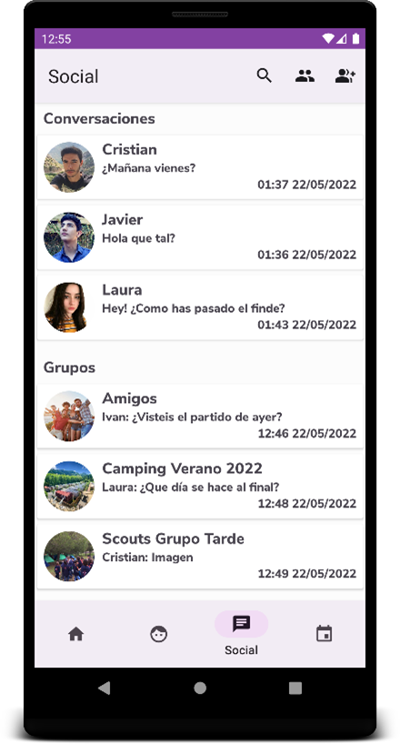

### Chats

The list of chats with users appears on the main page of “Social” along with the last message sent and its corresponding date.

#### Chats list

The list, as mentioned, appears on the main page of "Social".

#### Create chat

A chat can be created from various sections of the application, which have been or will be discussed during the manual. When creating the conversation, the list of messages between users will appear empty.

#### View chat

To access a chat, all you have to do is click on any of the existing ones, opening the list of messages between the two users.

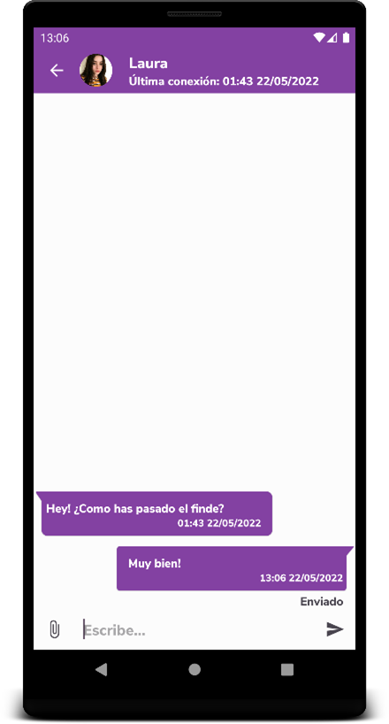

#### Send message

To send a message, all you have to do is fill in the lower text field and press the right button.

#### Send image

To send an image, you just have to click on the left clip. You can select an image from the gallery or take a new one with the camera.

#### Delete message/image

A message or image may be deleted. To do this, click on the one you want to delete, displaying a deletion confirmation message. Upon confirmation, the message/image information will no longer be visible.

#### See profile of the user with whom you are chatting

By clicking on the name of the user with whom you are conversing, you can visit the profile.

### Groups

The groups to which the user belongs appear on the main “Social” page.

#### Groups list

As mentioned, the list appears on the main page of "Social".

#### Create group

To create a group, it is necessary to press the right button that appears in the upper bar, the page to create the group appears, needing to add a title and description, and an image optionally.

#### View/Create messages

To view and create messages, it is done in the same way as it is done with individual conversations.

#### Group information

You can access the information of a group by clicking on its name within the conversation.

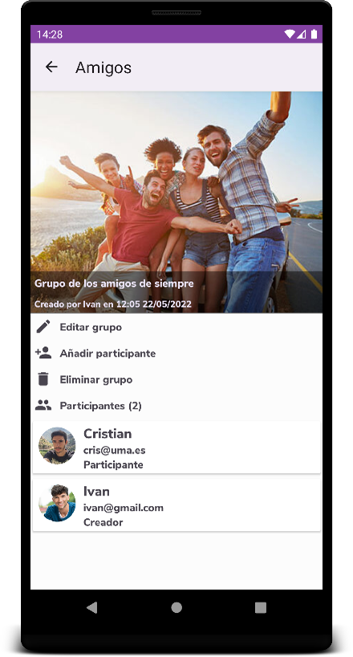

#### Edit group

To edit a group, you will need to be the creator of the group. You will have to press “Edit group” in the group information. A page will open for editing.

#### Add participant to group

To add a new participant to the group it will be necessary to be the creator or an administrator of the group. You will have to press “Add participant” in the group information menu. A list will appear with the users who do not yet belong to the group. To add them you will have to click on the user and confirm the addition.

#### View group participants

Group participants appear in a list at the bottom of the group information page along with their assigned roles.

#### Delete group participant

To delete a participant it is necessary to be the creator or an administrator of the group. To do this, click on the user you want to remove from the list provided in the group information section and then select "Remove participant".

#### Change role of a group participant

The creator or a group administrator can change the role of the different participants, both ascending and descending.

#### Delete group

Only the group creator is allowed to delete the group. To do this, you must press “Delete group” in the group information panel.

#### Leave group

Any user belonging to a group is free to leave the group, except the creator. To leave the group you will have to press “Leave the group” in the group information panel.

### Search groups/chats

By pressing the magnifying glass belonging to the top menu of "Social", you can filter the conversations and groups by name.

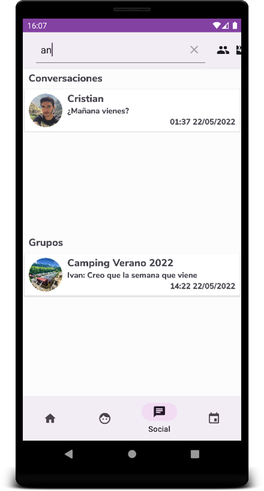

### Search users

To see the list with all the users of the application, it is necessary to press the central button of the upper menu of "Social". In addition, users can also be filtered by name or email.

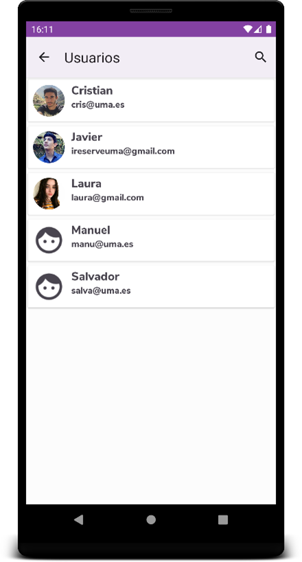
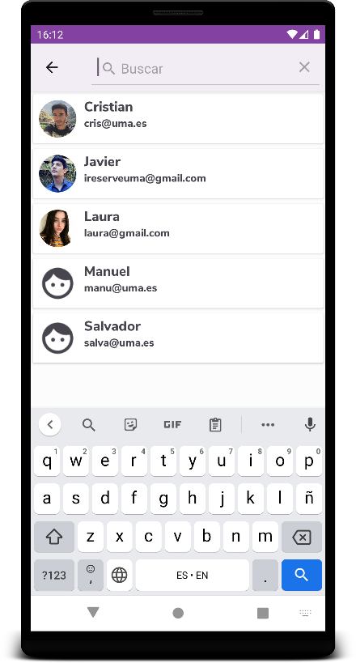

## Events

The events section is accessible through the lower navigation menu, by clicking on “Events”.

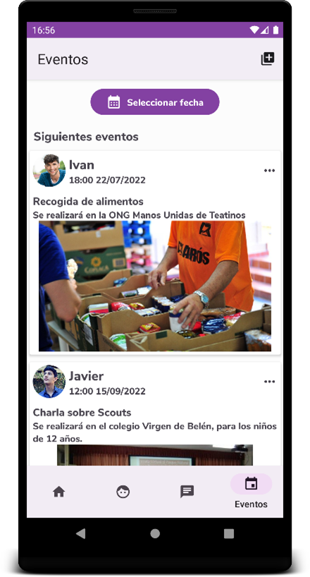

### Following events

Upcoming events will appear on the main events page, sorted by date.

### Filter by date

Events can be filtered by specific date through a selector on the main page, by clicking on “Select date”.

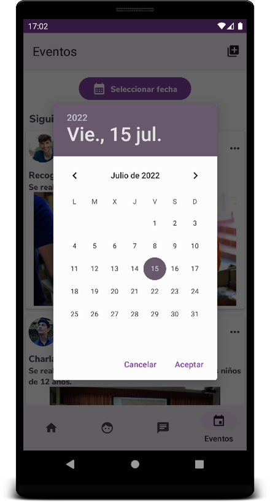

### Create event

Only users with monitor role will be able to create events. To do this it is necessary to press the button on the upper right menu. A form will appear where it will be necessary to fill in the title, description and date, the image being optional.

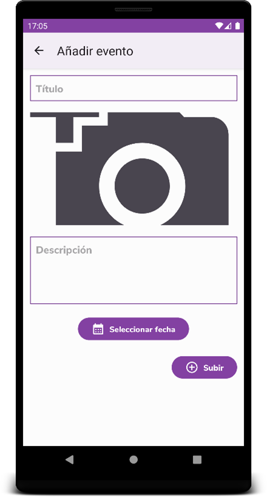

### Edit event

An event can only be edited by its creator. To do this, click on “…” and then on “Edit”. A page will appear with a form to edit the already created event. To save it, click on "Edit".

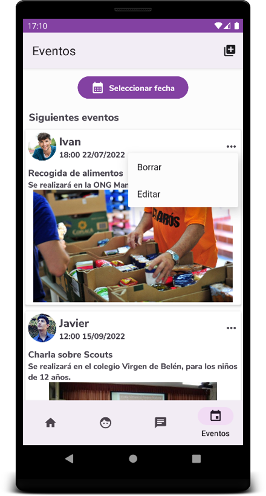
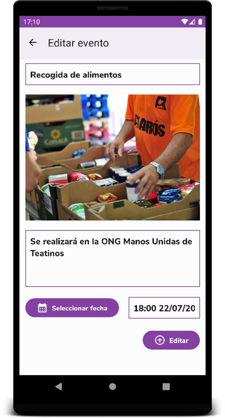

### Delete event

An event can only be deleted by its creator. To do this, click on “…” and then on “Delete”. Finally, it will be necessary to confirm the deletion.

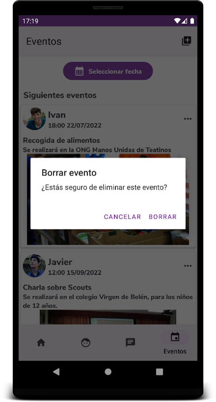

